# The-Beauty-and-Joy-of-Computing

[Erste Informatikstunde](#eins)

[Zweite Informatikstunde](#zwei)

[Dritte Informatikstunde](#drei)

[Vierte Informatikstunde](#vier)

[Fünfte Informatikstunde](#fünf)

[Sechste Informatikstunde](#sechs)

[Siebte Informatikstunde](#sieben)

[Achte Informatikstunde](#acht)

##Erste Informatikstunde                                                              15.09.2016

###Bekanntmachung mit Snap!

 

Nachdem wir uns zu Hause einzeln
über die freundlich organisiert war. Außerdem wir die Anwendung genutzt, an
Schulen und Universitäten in hauptsächlich den USA. Somit gehören wir, als
Schüler, zur Zielgruppe des Tutorials, was unsere Entscheidung zusätzlich
beeinfluunterschiedlichen Programme informiert hatten, besuchten wir gemeinsam
die Homepages der für uns interessanten Optionen: „Greenfoot“ und „The Beauty
and Joy of Computing“

Wir suchten uns einige Tutorials
zu „Greenfoot“ raus und starteten mit der „Wombats Welt“, um uns einen
Überblick über die Anwendung zu verschaffen. Allerdings fanden wir keinen
richtigen Zugang, hatten kein ausreichendes Grundwissen und waren skeptisch
gegenüber der Bildungssoftware. Nach der Stunde waren wir uns noch unschlüssig,
welche der beiden Anwendungen wir zum lernen nutzen wollten und nahmen uns ein „Greenfoot“
Buch mit nach Hause, um uns weiter damit auseinanderzusetzen. 

Schließlich entschieden wir uns für „Beauty
and Joy of Computing“, da die bunten Farben der blockbasierten
Programmierprache Snap! ansprechend und der Lehrplan (Curriculum) schüler- und
studentensste. Überzeugt hat uns zudem das Argument des Programmtitels, welcher
Schönheit und Freude des Programmierens verspricht.

Wir freuen uns nun sehr auf die
nächste Stunde, in der wir mit einem Tutorial von „The Beauty and Joy of
Computing“ starten werden.

##Zweite Informatikstunde                                                              19.09.2016

###Programming Lab 2: Sprite Drawing and Interaction

Drawing and Motion:

Wir haben zuerst die vier verschiedenen Blöcke (repeat,
move, turn, pen down) wie beschrieben zusammengesetzt und die passenden Zahlen
eingegeben. Es entstand ein Quadrat.

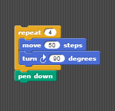

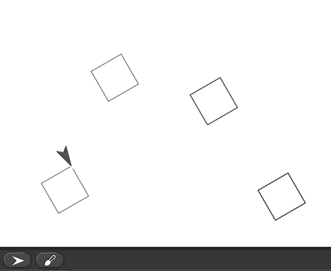

Nun veränderten wir
die „move“ Zahl. Bei unserem Beispiel wurden die Quadrate (wie im folgenden
Bild zu sehen) größer.

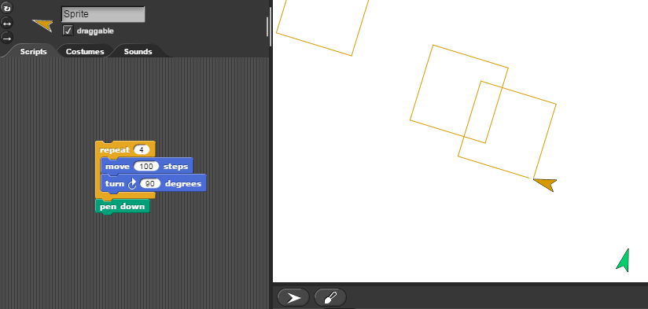

Danach wurden zudem auch die Zahlen des „repeat“ und „turn“
Blocks verändert.

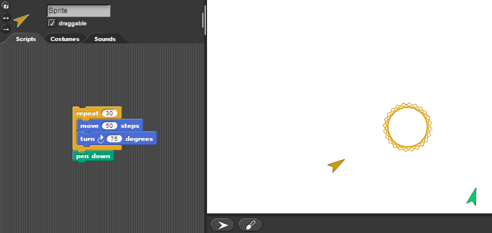

Dabei probierten wir einiges aus…

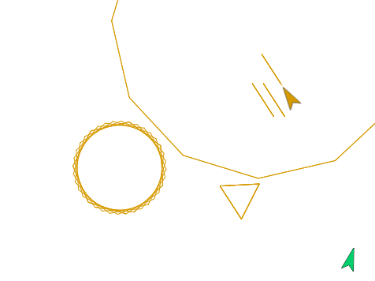

Schließlich bestand unsere Aufgabe darin, ein Dreieck zu
erstellen. Dies gelang uns durch eine Drehung von 120 Grad.

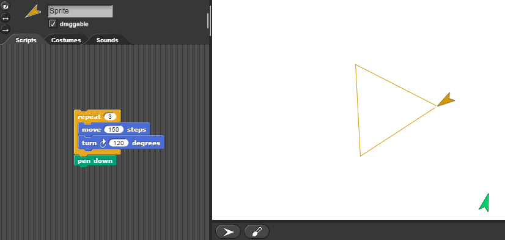

Durch einen weiteren Block „set pen size to“ konnten wir
dann die Dicke der erstellten Linien verstellen.

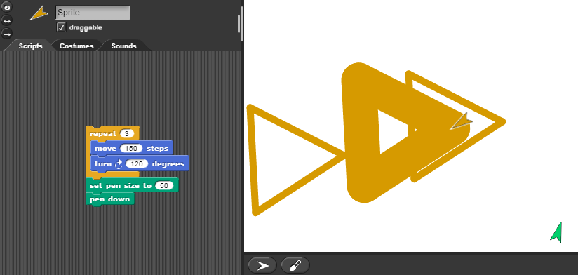

Schließlich lernten wir, wie wir unseren Pfeil wiederfinden,
wenn er mal aus dem Feld verschwinden sollte. Wir nutzten den „go to x:  y:“ Block dafür. Im folgenden Bild sieht man
die Fortbewegung des Feils anhand der dicken Linien.

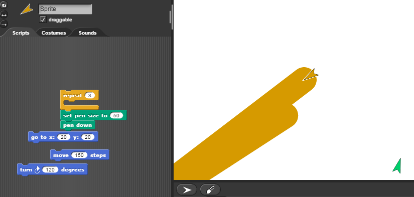

Allgemein sind wir zufrieden mit der heutigen Stunde. Wir
haben schon einige Schritte gelernt, die uns später beim weiteren Programmieren
helfen werden. 

##Dritte Informatikstunde                                                              26.09.2016

###Unit 1: Lab 2: Sprite Drawing and Interaction

Take it further

Heute
haben wir die verinnerlichten Inhalte der letzten Stunde noch einmal versucht
selbst anzuwenden. 

Zuerst programmierten wir den Sprite einige Quadrate in blau und der Stiftdicke 1 zu
zeichnen. Mit den Blöcken „pen down“ , „set pen colour to“ und „set pen size
to“ legten wir dieses aussehen fest. Für das zeichnen wendeten wir die bereits
gelernten „move“ und „turn“ Blöcke an. Durch unterschiedliche Längen der
„steps“ kamen unterschiedlich große Quadrate zu stande. Unsere Aufgabe bestand
nun darin, einen Kreis von dem Sprite in ein Quadrat zeichnen zu lassen. Für den
Kreis ließen wir den Sprite 390 mal 
„move…steps“ längen machen und  um
jeweils ein Grad drehen. Um den Kreis zu differenzieren ließen wir ihn in rot
Zeichnen. Um nun den ersten Kreis in eines der Quadrate anzupassen, legten wir
eine neue Größe fest. So zeichnete der Sprite einen Kreis in eins der
vorhandenen Quadrate. 

Unsere Versuche sieht man im folgenden Bild
zusammengefasst: 

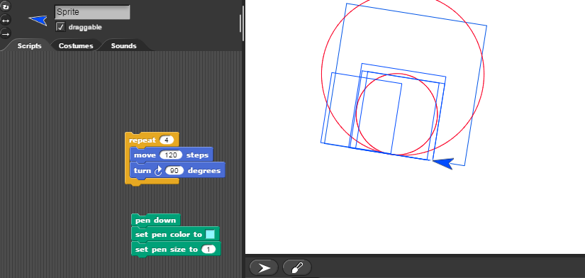
 
Nachdem
wir die Aufgabe des Tutorials gemeistert hatten, haben wir noch weitere eigene Versuche
gestartet. Wir ließen den Sprite verschiedene Kreise zeichnen. Diese hatten
verschiedene Größen, Dicken und Farben. Dazu wurden die Blocks „set pen colour to“ und
„set pen size to“ verändert. 

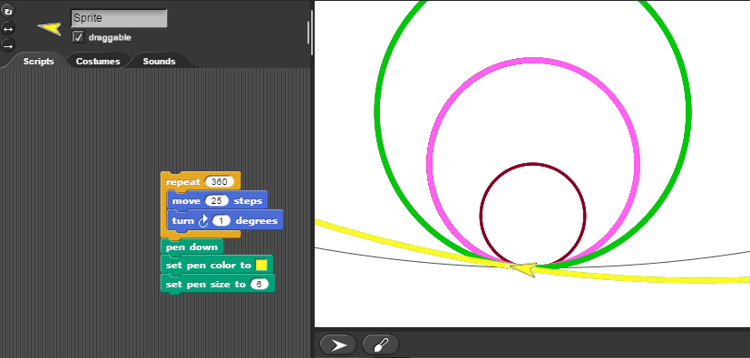

##Vierte Informatikstunde                                                              29.09.2016

###Unit 1 Lab 2: Sprite Drawing and Interaction             

Programming a Sprite to Follow a Motion:

In der nächsten Lektion sollten
wir einen „Sprite“ so programmieren, dass er der Maus folgt, wenn wir sie über
den Bildschirm bewegen.

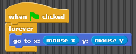

Dazu wird ein Block eingesetzt,
welcher dem Sprite befiehlt, den Koordinaten der Maus zu folgen. Damit dies bei
jeder Bewegung der Maus erneut geschieht, wird ein „forever“-Block hinzugefügt,
der das eben beschriebene Programmstück umschließt. Um das Programm zu starten
muss man auf die grüne Fahne klicken. Dieser Befehl wir durch einen weiteren
Block ausgeführt, der das Programm nur startet, wenn man die grüne Fahne
klickt. Dieser „hat“-Block impliziert nicht, was das Programm tun soll, sondern
welches „event“ das Programm auslöst.

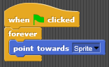

Nun wurde ein zweiter Sprite hinzugefügt, dessen Pfeilspitze
immer in die Richtung des ersten Sprites zeigen soll. Auch dieser Programmteil
wird durch klicken der grünen Fahne aktiviert.                                                                                    

Um aus dem zuvor
erschlossenen Programm ein Spiel zu erstellen, muss ein Ende der Aktion
definiert werden. In diesem Fall setzen wir statt dem „forever“-Block einen
„repeat until“-Block ein. Dieser führt das Programm, welches er umschließt, nur
aus, bis der zweite Sprite mit dem ersten in Berührung kommt. Für zusätzliche
Interaktion soll sich Sprite2 auf den ersten Sprite zubewegen, wie beim fangen.
Deshalb definieren wir eine spezifische Anzahl von Schritten, die Sprite2 in
die Richtung machen soll, in die er zeigt. Logischerweise bewegt sich Sprite2
also immer in Richtung des Sprite.  So
wird aus unserem Programm eine Art Fangspiel, das endet, sobald die beiden
Sprites sich berühren. 

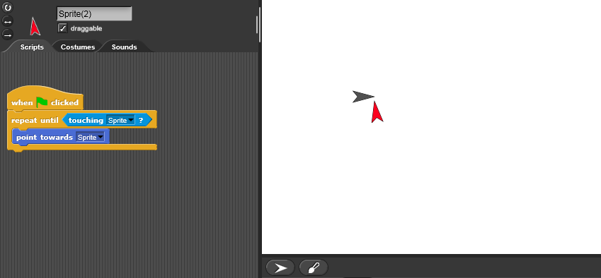

Übersetzung: Sobald die grüne Fahne geklickt wurde, zeigt
Sprite2 solange in Richtung des Sprite, bis beide miteinander in Berührung kommen.

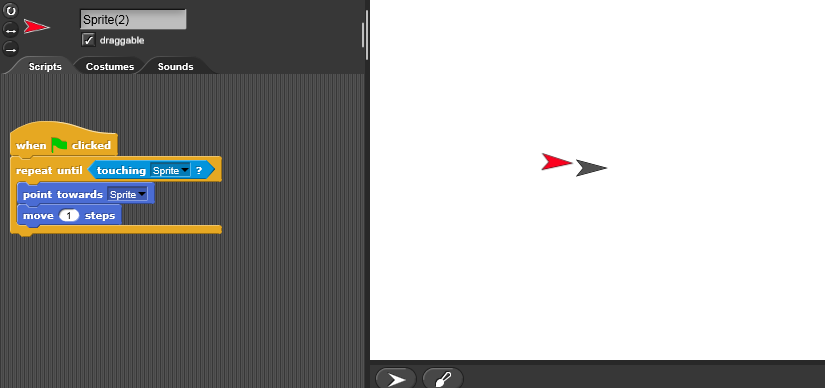

Übersetzung: Sobald sie grüne Fahne geklickt wurde, zeigt
Sprite2 in Richtung des Sprite und bewegt sich je einen Schritt auf diesen zu,
bis beide miteinander in Berührung kommen. 

Um das Spiel ansprechender zu
gestalten, wollten wir ein Gespräch zwischen den beiden Sprites aufzeigen.
Dabei ist zu unterscheiden zwischen dem Block „say“ und dem Block „think“.
Beide funktionieren ähnlich, zeigen dem Spieler ein Display mit Text, den wir
zuvor festgelegt haben. Der Unterschied besteht darin, dass eine Sprechblase
oder eine Denkblase erscheinen kann. Damit nicht beide Sprech- bzw. Denkblasen
gleichzeitig erscheinen, legen wir eine Reihenfolge im Skript des Sprite2 fest.

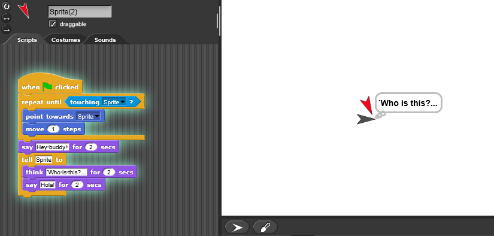

Übersetzung: Sobald sie grüne
Fahne geklickt wurde, zeigt Sprite2 in Richtung des Sprite und bewegt sich je
einen Schritt auf diesen zu, bis beide miteinander in Berührung kommen. Er
begrüßt den Sprite freundlich mit „Hey Buddy!“. Dieser bekommt von Sprite2 den
Befehl, zunächst „Who is this?“ zu denken und anschließend auf Spanisch, mit
„Hola!“ zu antworten.

Der letzte Arbeitschritt dieser
Stunde war die Gestaltung des Hintergrundes und der Sprites. Den
Spielplatzhintergrund haben wir aus mehreren Formatvorlagen ausgewählt und dem
Element „Stage“ zugeschrieben. Die beiden Sprites haben wir unter der Kategorie
„Costumes“ wie Hund und Einhorn aussehen lassen. Dem Script haben wir den
Befehl hinzugefügt, die Größe der Sprites nach unserem Belieben und
künstlerischem Auge zu verändern, also zu vergrößern und zu verkleinern. Dies
geschah mithilfe eines „set size to“- Blocks. In diesem Fall gefiel uns die
halbe Größe des Originals.

Auf dem Folgenden Bild ist das
fertige Produkt zu sehen.

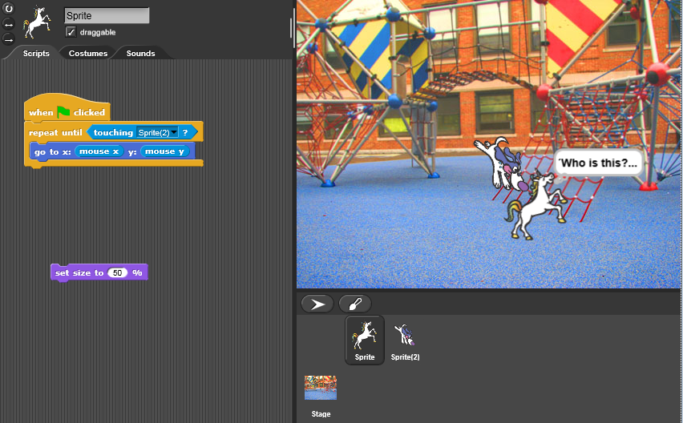

##Fünfte Informatikstunde                                                              06.10.16

###Unit 1 Lab 3: Building Your Own Blocks 

In dieser Doppelstunde
haben wir uns hauptsächlich mit dem Erstellen, Gestalten und Gebrauchen von
eigenen Blöcken befasst. Indem wir mehrere Aktionen im Skript unter einem
Oberbegriff zusammenfassen, abstrahieren wir das Programm und machen es
übersichtlicher. Diese Arbeit passiert im sogennanten „Block Editor“.

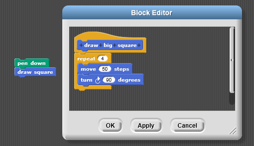

Das hier ist ein Beispiel für
einen der Blöcke, den wir erschaffen haben. Er fasst in sich das Skript, dass
man zum Zeichnen eines großen Quadrates braucht. 

Jeder neu erschaffene Block wird
in verschiedene Kategorien organisiert und betitelt:

Zunächst muss eine sogenannte
„Palette“ gewählt werden, ein Überbegriff für Programmstücke ähnlicher Art.
Dieser „draw big square“-Block ist blau, zählt also mit zur Palette „Motion“.
Bei dieser Einteilung haben wir und an ähnlichen, bereits in dieser Palette
vorhandenen Blöcken („move“ und „turn“) orientiert. 

Im zweiten Schritt muss dem Block
einen Titel gegeben werden, in diesem Beispiel lautet er „draw big square“. 

Nun muss der Block einer von drei
Kategorien zugeteilt werden, „Command“, „Reporter“ oder „Predicate“.
„Command“-Blöcke implizieren eine Aktion, also beispielsweise eine Bewegung.
„Reporter“-Blöcke nennen und zeigen Werte von Variablen, also beispielsweise
Zahlen oder Texte. „Predicate“-Blöcke prüfen eine Situation und teilen dieser
einen Booleschen Wert zu, der nur zwei Zustände haben kann, wahr oder falsch.
Unser Beispielblock fällt unter die Kategorie „Command“, da er eine Aktion des
Sprites einberuft. 

Zuletzt wird das verhalten des
Blockes definiert. Im Block Editor kann man mehrere Programmstücke unter einem
Block zusammenfassen, wie auch am Beispielbild oben sichtbar ist. 

So haben wir einen
Block erschaffen, der in Aktion ein Quadrat mit vorbestimmter Seitenlänge
zeichnen kann. Viermal hintereinander bewegt er den Sprite  um 50 Schritte geradeaus, und dann um 90° im
Uhrzeigersinn drehen, sodass ein Viereck entsteht. 

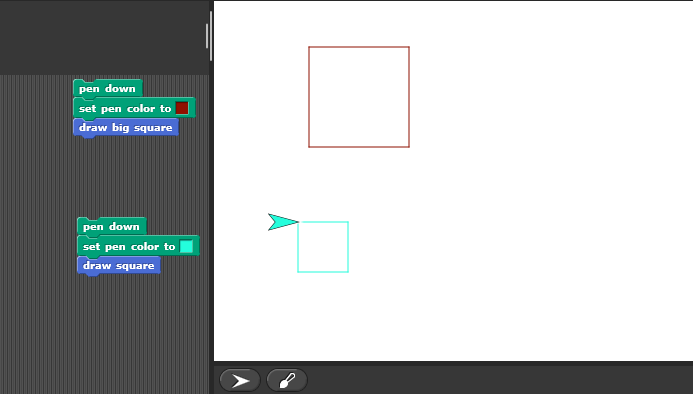

Auf diesem Screenshot sieht man, wie das Ergebnis der Blöcke
„draw square“ und „draw big square“ aussieht, nachdem wir das jeweilige Skript
umgesetzt haben.

Nach dem selben Prinzip
erstellten wir eigene Blöcke zum Zeichnen von Dreiecken, eines mit der
Kantenlänge 50 („triangle“) und eines mit der Kantenlänge 100 („big triangle“).

Anschließend haben wir noch Polygene
erstellt.

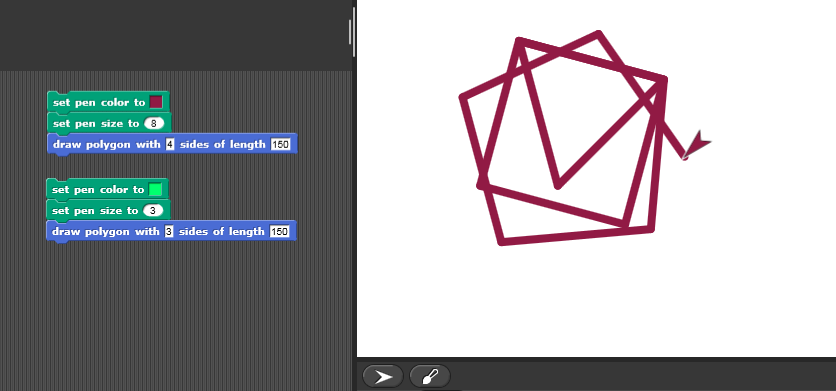

Nach den ersten Erfolgen veränderten
wir die Farbe und Stiftdicke. 

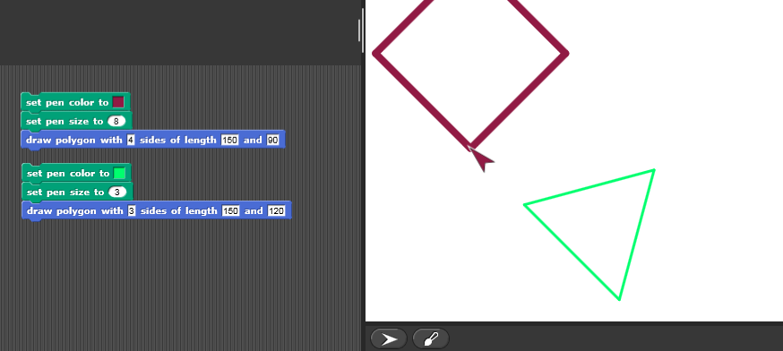

Wir erstellten ein lila Polygen, mit der Stiftdicke fünf.
Dieses hatte vier Seiten, es entstand also ein Viereck. Das zweite Polygen
sollte türkis sein und die Stiftdicke war auf drei definiert. Es entstand nun
ein Dreieck.

##Sechste Informatikstunde                                                              10.10.2016 

###Unit 1: Lab 3: Building Your Own Block

Um unser Verständnis des Prinzips aus der letzten Informatikstunde
noch zu vertiefen, wollten wir noch einen Schritt weitergehen, und jeweils zwei
der eigenhändig erstellten Blöcke zu einem zusammenfassen. Unser Endergebnis
sollte ein Programm sein, das „square“ und „triangle“ so kombiniert, dass ein
Haus entsteht. Hier ist unser Vorgehen visuell dargestellt. Es handelt sich um
einen Screenshot des Block Editors. 

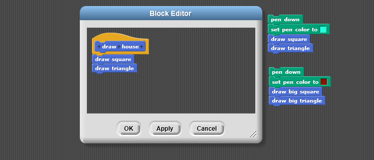

Der Sprite führt zunächst die Aktion „draw square“ und anschließend
die Aktion „draw triangle“ aus, sodass am Ende ein Abbild eines Hauses
entsteht, wie unten gezeigt. 

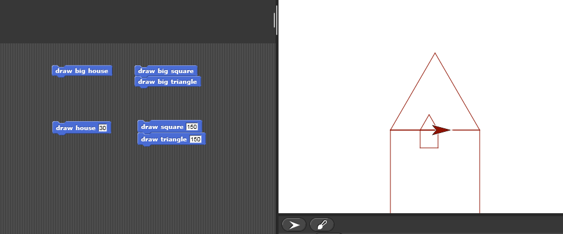

Wir verbesserten die Häuser
noch durch unterschiedliche Farben.

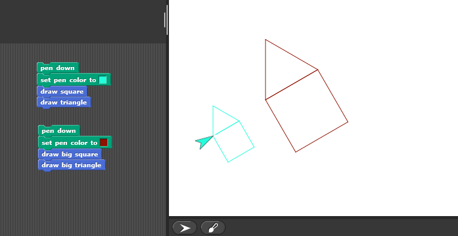

Nun wollten wir mehrere dieser
Häuser aneinanderreihen, und erstellten auch dafür einen eigenen Block. Damit
die Hausreihe parallel zur X-Achse, also waagerecht, verläuft, fügten wir noch
einen weiteren Block hinzu. Dieser „point in direction“-Block diktiert dem
Sprite, sich nach rechts auszurichten, bevor er den übrigen Teil des Programmes
ausführt. Damit der Sprite sich jedoch nicht endlos in Richtung 90 bewegt,
fügten wir einen Maximalwert der X-Koordinate hinzu. In diesem Fall sollte das
Ausführen des Skriptes enden, sobald X einen Wert von über 200 annimmt. So sah
unser Endergebnis aus:

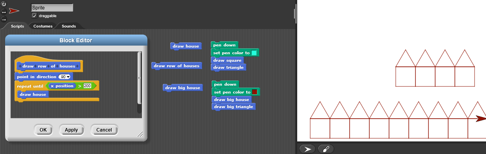

##Siebte Informatikstunde                                                             13.10.2016

###Unit 1 Lab 3: Building Your Own Blocks                      

In diesem Teil des Kapitels haben wir uns weiterhin mit
Variablen im „for“-Block auseinandergesetzt. Dieser Teil des Programms lässt
uns eine Variable benennen und ihren Zahlenbereich definieren. Mithilfe dieser
Erkenntnis und dem Wissen aus den vorherigen Kapiteln konnten wir eine quadratische
Spirale vom Sprite zeichnen lassen, die für den Viewer im Interface sichtbar
wird. 

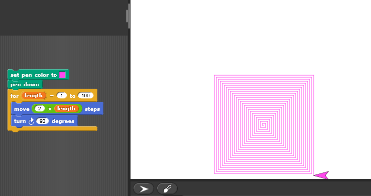

Übersetzung: Beim Starten des Programmes wird dem Sprite,
der hier als Stift dient, eine von uns ausgewählte Farbe zugeschrieben. Sobald
der Stift auf das „Papier“ gesetzt wird, hat dieser automatisch eine Länge von
1, löst also das Programm im „for“-Block aus. Er bewegt sich um den doppelten
Betrag seiner Länge nach vorn, und dreht sich dann um 90° nach rechts. Dieser
Vorgang wiederholt sich, bis die Länge 100 erreicht wird und eine quadratische
Spirale sichtbar wird.  Die Zeichnung
beginnt und endet bei den von uns definierten Längenwerten.

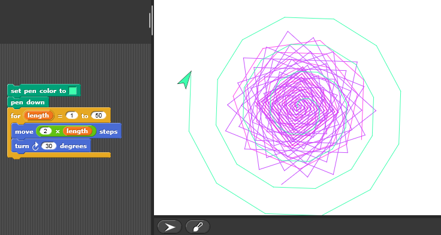

Bei diesem Programm können wir
jedoch nicht nur die Länge der Strecken, sondern auch den Winkel der Drehungen
festlegen. Auf dem oben zu sehenden Screenshot haben wir mit verschiedenen
Stiftfarben, Innenwinkeln und Längenbereichen experimentiert, sodass am Ende
ein graphisches Muster entstanden ist. 

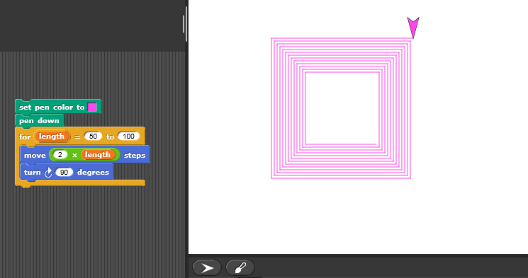

Hier sieht man, was passiert, wenn bei gleichem Winkel die
Länge der Seitenkanten der quadratischen Spirale verändert werden. 

Nun wollten wir ein größeres Muster erschaffen, und dabei
etwas Spaß und Farbe mit ins Spiel bringen. In den letzten Stunden haben uns
die „Costumes“ für den Sprite so gut gefallen, dass wir sie noch einmal
einbringen wollten. Deshalb schrieben wir ein Programm für eine größere
Spirale, deren Inneres von einer Fledermaus und deren Äußeres von einem Einhorn
gezeichnet werden sollte, welches bunte Spuren hinterlässt. Die maximale
Kantenlänge von 100 teilten wir in der Mitte und erschafften so zwei kleinere
Definitionsbereiche, zwischen denen das Zeichnen kurz unterbrochen werden
sollte, um das Kostüm des Sprites zu ändern. 

Am Anfang hat dies jedoch nicht nach unseren Vorstellungen
funktioniert, und wir mussten zwei kleine Details im Programm verändern.

Erstens waren Fledermaus und Einhorn viel zu groß, weshalb
wir die Größe der Kostüme im Verhältnis zu deren Originalgröße manuell
eingestellt haben.

Dies wiederum hat, in Kombination mit einem weiteren
Fehler, zu einer Verschiebung des Musters geführt. 

Zweitens hatten wir die Variable „length“, welche die
Kantenlänge beschreibt, nicht richtig dupliziert, sondern nur umbenannt,
weshalb im zweiten Teil des Programmes eine andere Variable verwendet wurde,
als im ersten teil. Das wäre zunächst nicht weiter schlimm gewesen, aber
dadurch, dass wir die Größe des Sprites auf 30% reduziert hatten, reduzierte
sich nun auch die Kantenlänge der äußeren Spirale um 30%. Deshalb war
für uns folgende Grafik sichtbar:

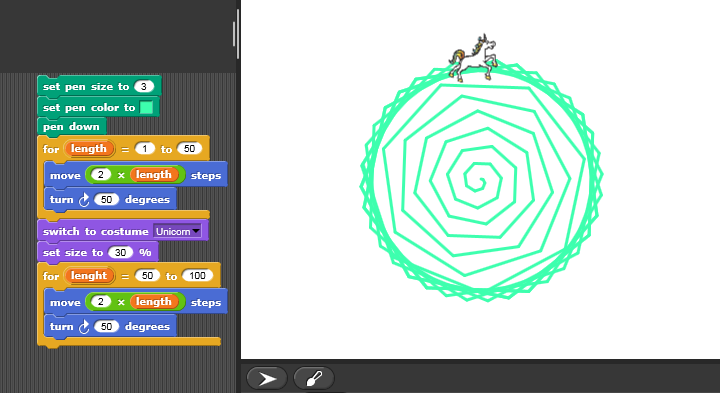

Doch nach Verständnis
und Berichtigung dieser Fehler entstand schließlich folgende Grafik:

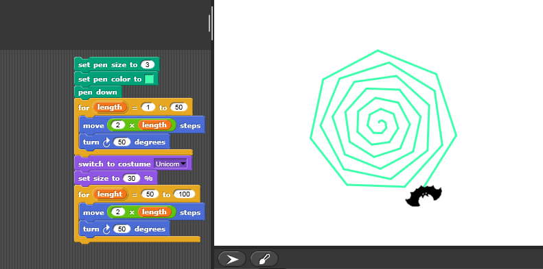

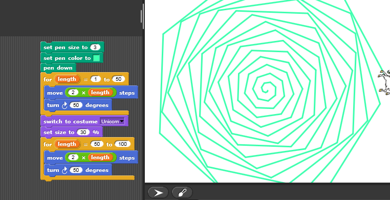

Übersetzung: Nach Starten des Programmes wird der Sprite als
„Stift“, dessen Farbe Türkis und Länge 3 definiert sind, auf das „Papier“
gesetzt. Im Intervall von 1-50 bewegt er sich um die doppelte Kantenlänge und
dreht sich nach jeder Bewegung um 30° in den Uhrzeigersinn. Anschließend ändert
sich das Kostüm des Sprites, sodass er wie ein Einhorn aussieht. Dieses bekommt
nur 30% seiner Originalgröße zugeschrieben. Im Intervall von 50-100 bewegt er
sich um die doppelte Kantenlänge und dreht sich nach jeder Bewegung um 30° in
den Uhrzeigersinn.

##Achte Informatikstunde                                                              31.10.2016

###Eigener Versuch etwas zu programmieren 

Nach dem schauen verschiedener Youtube Tutorials versuchten
wir in dieser Stunde etwas Eigenes zu programmieren. 

Um das ganze per Mausklick zu aktivieren starteten wir mit dem
„when clicked“ Block. Im Folgenden ließen wir den Sprite 60-mal vom Standort
10-10 jeweils 50 Schritte gehen und um 50 Grad drehen. Das der Sprite diese
Schritte zeichnet legten wir mit dem „pen down“ Block fest. Den gleichen Ablauf
programmierten wir noch einmal, diesmal aber mit 20 Wiederholungen.

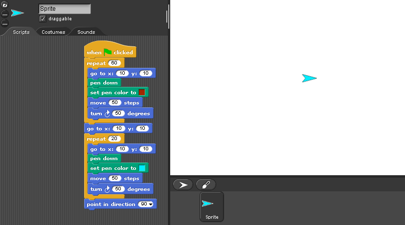

Wir legten für den ersten Ablauf die
Farbe blau fest und für den zweiten Ablauf rot. Klickt man nun die grüne Fahne
mit der Maus, zeichnet der Sprite zwei Sterne. Diese überlagern sich zwar, sind
jedoch durch unterschiedliche Farben und Wiederholungen beide zu erkennen. So
entsteht folgender Weihnachtsstern (als Vorbereitung der Vorweihnachtszeit):

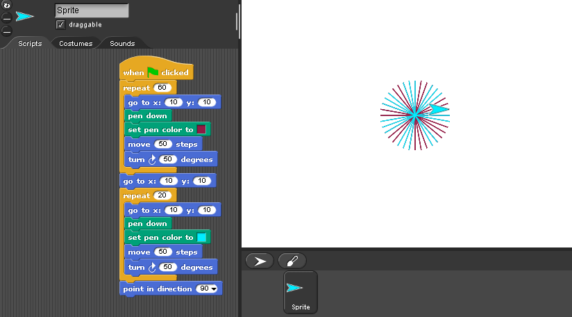

Da wir in unser zweiten Informatikstunde schon lernten, wie
man den Sprite ein Quadrat zeichnen lässt, versuchten wir diese vereinfachte
Art und Weise noch einmal in genauer nachzuvollziehen. 

Nach dem „when clicked“ Block setzten wir zunächst einen
„clear“ und „pen up“  Block, sodass die
Umgebung des Sprites gereinigt wird. Um die später programmierte Zeichnung zu
sehen, soll der Sprite am Standord 0-0 und in Richtung 90 Grad links beginnen.
Zudem wird mit dem „pen down“ Block festgelegt, dass der Sprite zeichnen soll
und dem „set pen colour to“ legten wir die Farbe Rot für die Zeichnung fest.
Ein Quadrat besteht aus vier gleichlangen Strecken, welche jeweils in einem 90
Grad Winkel zu einander stehen. Wir legten jeweils 50 Schritte als
Streckenlänge fest. Der Sprite dreht sich nach diesen jeweils um 90 Grad nach
rechts. Setzt man diesen beiden Blöcke vier Mal hintereinander, entsteht ein
Quadrat.

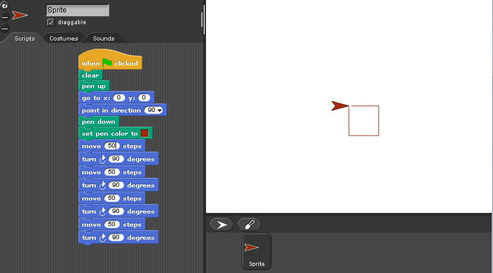

Die bereits genannten Schritte kann man nun auch zu einem
neuen Block zusammenfassen. Neue Blöcke kann man beliebig benennen.

Hier sieht man die vereinfachte Form zum Zeichnen eines
Quadrats. Es werden jeweils 100 Schritte gegangen und um 90 Grad nach rechts
gedreht. Dies wird vereinfach durch den „repeat“ Block vier Mal wiederholt. Wir
nennen unseren neuen Block „sqaure“. Es erscheint nun neben den bereits vorhandenen
Blöcken und kann beliebig oft genutzt werden.

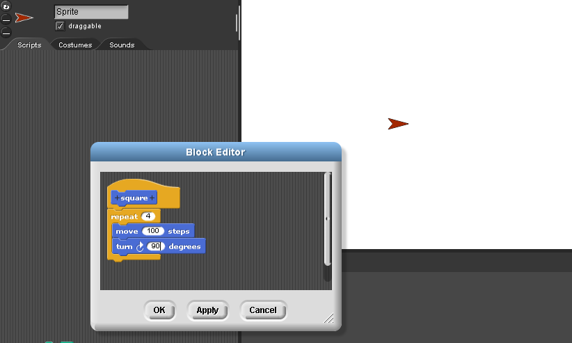

Natürlich können diese Blöcke wieder bearbeitet werden. Zum
Beispiel umbenannt werden oder aber auch verändert werden.

 
Nach dem Studieren dieser Tutorials freuen wir uns nun sehr darauf, ein eigenes Projekt zu erstellen und zu programmierne;) 
 

 

 

 

 

 

